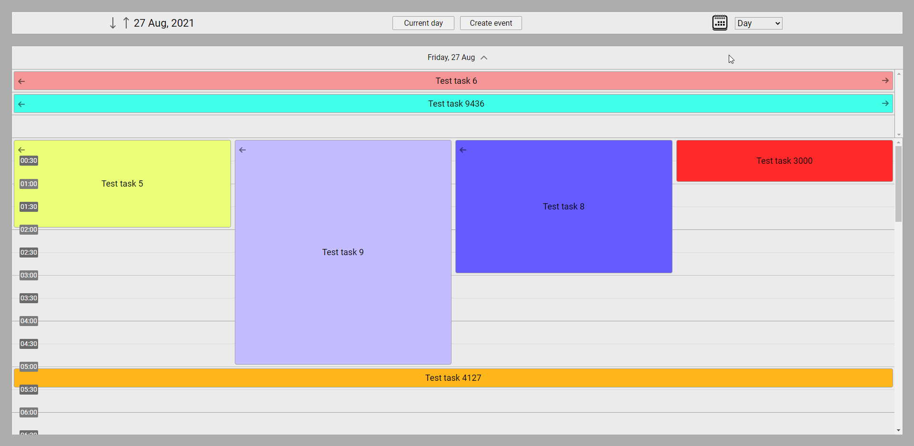
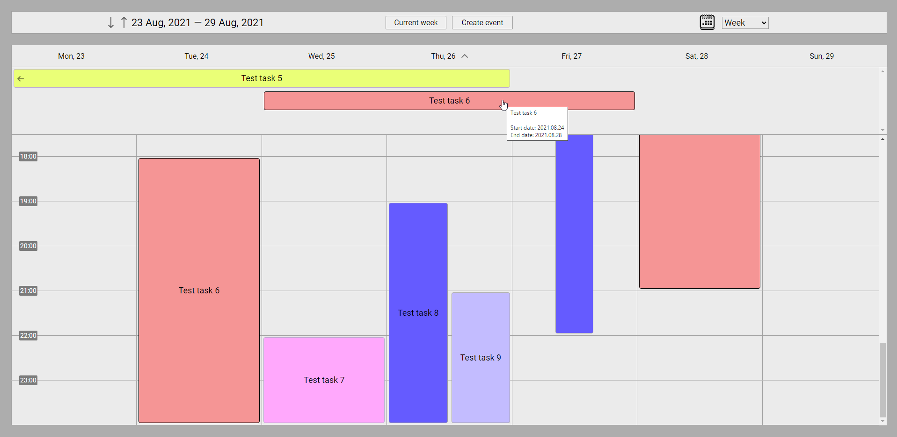
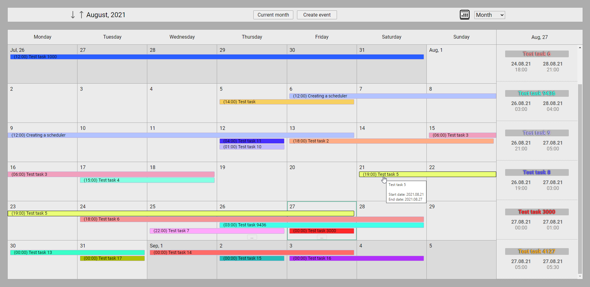
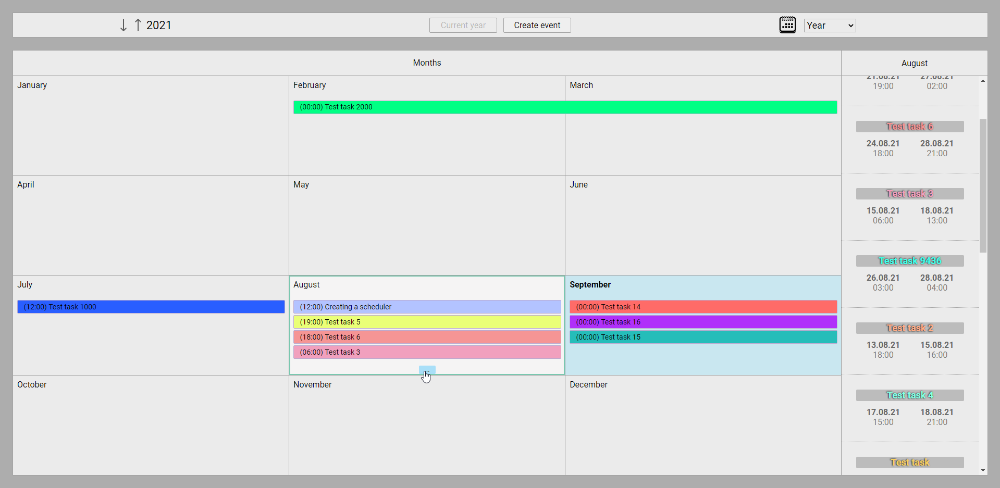
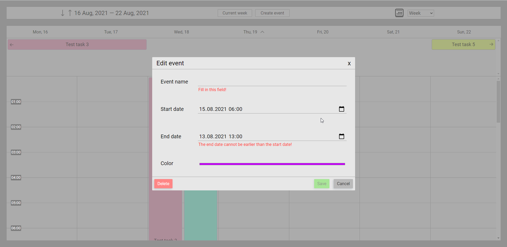

# Angular scheduler

## What is this project?

This project is an attempt to recreate the functionality of the event scheduler, similar to Microsoft Outlook with some simplifications. Unlike the Microsoft version, here an annual presentation was added to the three existing views, which, as far as we know, has not been done by anyone before.

Angular 12 was used for the development.

## Daytime perfomance

## Weekly perfomance

## Monthly perfomance

## Annual perfomance

## Create & edit modal window

# How can you use this project?
As an example for creating your own scheduler on Angular.

# Demo
You can follow [the link](https://overfirst.github.io/angular-scheduler/) for watching a demo.

# Browser support
For latest versions of:
- Chrome
- Opera
- Edge
- Yandex.Browser

# Development
- Clone this repository
- Run the `npm install` command in the root of the repository
- Run the `npm run start` command to start the local development server
